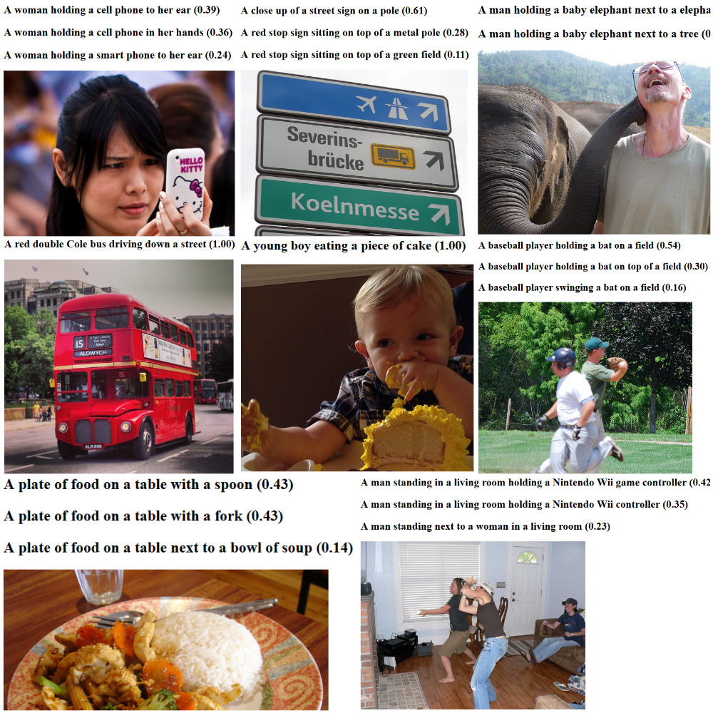
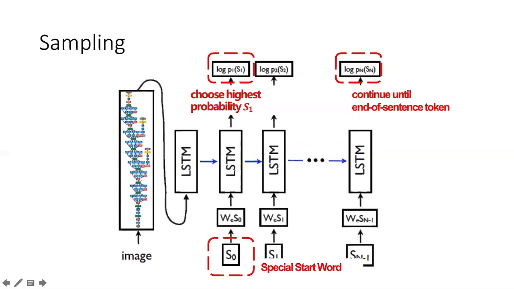

# 			Show and Tell: A Neural Image Caption Generator
[](https://8i7gm9hsh8.execute-api.us-east-2.amazonaws.com/production)    [](https://github.com/svaisakh/captioner/blob/master/LICENSE)

 

an implementation inspired by the [paper](https://arxiv.org/abs/1411.4555) by [Oriol Vinyals](https://ai.google/research/people/OriolVinyals), [Alexander Toshev](https://www.linkedin.com/in/alexander-toshev-9270726), [Samy Bengio](https://ai.google/research/people/bengio) and [Dumitru Erhan](http://www.dumitru.ca/).




## 					The Idea




We approach the problem in two stages:

1. ### Vision:

   A pre-trained CNN is used to extract the image features.

   In our case, we take a ResNet trained on ImageNet classification and detach it's head.

   The penultimate layer gives us the features.

   

2. ### Language:

      A pre-trained word embedding is used to process and tokenize the captions.

      In our case, we use the ['en_core_web_lg'](https://spacy.io/models/en#en_core_web_lg) model from spaCy.

      This is then teacher-forced to an RNN which predicts the next word.

### Combining the two

The extracted features are treated as the initial hidden state of the RNN.
In order to match the dimensionality, it's first sent through a Linear layer and reshaped.

On the basis of this conditioning, the model generates it's hidden states which are further sent through a Linear layer of dimension ```vocab_size```.

Thus, at each timestep, we have a score for each possible word.

We treat this like a classification problem and use the categorical cross-entropy loss to match it to the desired _label_ at each timestep.

### Sampling

We use beam search to sample the most likely caption at evaluation time.

## Using this repo

There are three ways you might want to use this project.

1. **Learn**: To follow along with the Jupyter Notebooks, go to the [notebooks](notebooks/) folder.
2. **Apply**: To execute on the command line, go to the [captioner](captioner/) folder.
3. **Serve**: To serve the model as a flask microservice, go to the [server](serve/) folder.

## Prerequisites

1. Follow the general steps in [this](https://github.com/svaisakh/using-lessons) tutorial to set up the environment and the startup file.

   **Make sure you have MagNet installed.**

2. Install [pycocotools](https://github.com/cocodataset/cocoapi) in the conda environment by running 

   `pip install "git+https://github.com/philferriere/cocoapi.git#egg=pycocotools&subdirectory=PythonAPI" `

3. Install the ['en_core_web_lg'](https://spacy.io/models/en#en_core_web_lg) model from spaCy by running `python -m spacy download en_core_web_lg `

## Pre-trained Model

A pre-trained model is available [here](https://s3.us-east-2.amazonaws.com/captioner/model.pt).

The hyperparameters are the defaults in the repo.

Place it in the [checkpoints](checkpoints/) directory and you're good to go.


